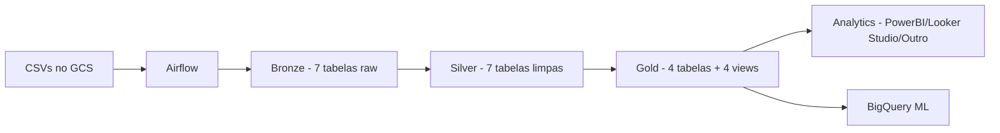

# 🛒 E-commerce Data Pipeline

Teste prático de Engenharia de Dados para o **Grupo FEG** — pipeline completo para um e-commerce, implementando a **arquitetura Medalhão** (Bronze → Silver → Gold) com **Apache Airflow**, **BigQuery** e **Docker**.

---

## 📋 Índice

- [Visão Geral](#-visão-geral)
- [Arquitetura](#-arquitetura)
- [Estrutura do Projeto](#-estrutura-do-projeto)
- [Pré-requisitos](#-pré-requisitos)
- [Setup e Deploy](#-setup-e-deploy)
- [DAGs do Airflow](#-dags-do-airflow)
- [Views Analíticas](#-views-analíticas)
- [Stack Tecnológica](#-stack-tecnológica)
- [Troubleshooting](#-troubleshooting)

---

## 🎯 Visão Geral

Este projeto consome **7 arquivos CSV** de um e-commerce (clientes, produtos, pedidos, itens, campanhas de marketing, atribuição de campanhas e eventos do Google Analytics) e os processa em 3 camadas:

| Camada | Dataset BigQuery | Descrição |
|--------|-----------------|-----------|
| **🥉 Bronze** | `bronze_ecommerce` | Dados brutos, todos os campos como STRING |
| **🥈 Silver** | `silver_ecommerce` | Dados limpos, tipados, deduplicados |
| **🥇 Gold** | `gold_ecommerce` | Dimensões, fatos e views analíticas |

**Projeto GCP:** `teste-dados-feg`  
**Bucket GCS:** `gs://teste-dados-feg-datalake/`

---

## 🏗️ Arquitetura



**Fluxo:**
1. CSVs armazenados no **Google Cloud Storage**
2. **Airflow** orquestra a ingestão (GCS → BigQuery Bronze)
3. Transformações SQL geram a camada **Silver** (tipagem, limpeza, deduplicação)
4. DAGs individuais materializam tabelas **Gold** (dimensões e fatos)
5. **Views** analíticas sobre Silver/Gold (LTV, Cohort, Anomalias, ROAS)

---

## 📁 Estrutura do Projeto

```
├── dags/
│   ├── config/
│   │   └── project_params.py          # Configuração centralizada (projeto, bucket, datasets)
│   ├── operators/
│   │   ├── gcs_to_bq.py               # Operator: GCS → BigQuery (Bronze)
│   │   └── bq_insert_job.py           # Operator: SQL → BigQuery (Silver/Gold)
│   ├── task_groups/
│   │   ├── bronze/
│   │   │   └── ecommerce_bronze.py    # TaskGroup: 7 cargas GCS → Bronze
│   │   ├── silver/
│   │   │   ├── ecommerce_silver.py    # TaskGroup: 7 transformações Silver
│   │   │   └── sql/                   # SQLs de transformação Silver
│   │   │       ├── silver_clientes.sql
│   │   │       ├── silver_produtos.sql
│   │   │       ├── silver_pedidos.sql
│   │   │       ├── silver_itens_pedido.sql
│   │   │       ├── silver_campanhas_marketing.sql
│   │   │       ├── silver_atribuicao_campanha.sql
│   │   │       └── silver_eventos_ga.sql
│   │   └── gold/
│   │       ├── ecommerce_gold.py      # TaskGroup: tabelas Gold
│   │       └── sql/                   # SQLs de transformação Gold
│   │           ├── dim_cliente.sql
│   │           ├── dim_produto.sql
│   │           ├── fato_vendas.sql
│   │           └── fato_marketing_performance.sql
│   ├── ecommerce_ingestao.py          # DAG principal: Bronze + Silver
│   ├── gold_dim_cliente.py            # DAG Gold: Dimensão Cliente
│   ├── gold_dim_produto.py            # DAG Gold: Dimensão Produto
│   ├── gold_fato_vendas.py            # DAG Gold: Fato Vendas
│   └── gold_fato_marketing.py         # DAG Gold: Fato Marketing
├── docker/
│   ├── Dockerfile                     # Imagem Airflow customizada
│   ├── docker-compose.yml             # Airflow + Postgres + Adminer
│   ├── requirements.txt               # Dependências Python
│   ├── start_airflow.sh               # Script de inicialização
│   └── service-account.json           # Credenciais GCP (não commitado)
├── scripts/
│   └── views/                         # Views analíticas (BigQuery)
│       ├── vw_ltv_por_canal.sql
│       ├── vw_cohort_recompra.sql
│       ├── vw_anomalias_vendas_diarias.sql
│       └── vw_roas_por_plataforma.sql
└── README.md
```

---

## ✅ Pré-requisitos

- **Docker** e **Docker Compose** instalados
- **Conta GCP** com projeto criado e BigQuery habilitado
- **Service Account** com permissões:
  - `BigQuery Admin`
  - `Storage Object Viewer`
- **Arquivo de credenciais** (`service-account.json`) da Service Account

---

## 🚀 Setup e Deploy

### 1. Clonar o repositório

```bash
git clone https://github.com/<seu-usuario>/ecommerce-data-pipeline.git
cd ecommerce-data-pipeline
```

### 2. Configurar credenciais GCP

Copie o arquivo `service-account.json` da sua Service Account para a pasta `docker/`:

```bash
cp /caminho/para/service-account.json docker/service-account.json
```

> ⚠️ **Nunca commite o `service-account.json`!** Adicione-o ao `.gitignore`.

### 3. Ajustar configurações do projeto

Edite `dags/config/project_params.py` com os dados do seu projeto GCP:

```python
GCP_PROJECT = "teste-dados-feg"       # Seu projeto GCP
GCS_BUCKET = "teste-dados-feg-datalake" # Seu bucket GCS
```

### 4. Subir os containers

```bash
cd docker
docker compose up -d --build
```

Isso irá:
- Buildar a imagem do Airflow com as dependências
- Subir o **PostgreSQL** (metadata database do Airflow)
- Subir o **Adminer** (UI para o PostgreSQL)
- Subir o **Airflow Webserver** com scheduler

### 5. Acessar o Airflow

Aguarde ~30 segundos para o Airflow inicializar, depois acesse:

| Serviço | URL | Credenciais |
|---------|-----|-------------|
| **Airflow UI** | [http://localhost:8080](http://localhost:8080) | `admin` / `admin` |
| **Adminer** | [http://localhost:9090](http://localhost:9090) | `airflow` / `airflow` |

### 6. Executar o pipeline

1. Acesse o Airflow UI em `http://localhost:8080`
2. Ative a DAG **`ecommerce_ingestao`** (toggle ON)
3. Clique em **Trigger DAG** (▶️) para executar
4. Aguarde a conclusão (Bronze → Silver)
5. Ative e execute as DAGs Gold individualmente:
   - `gold_dim_cliente`
   - `gold_dim_produto`
   - `gold_fato_vendas`
   - `gold_fato_marketing`

### 7. Criar as views analíticas

As views são criadas diretamente no BigQuery (não passam pelo Airflow). Execute cada script SQL da pasta `scripts/views/` no console do BigQuery:

```bash
# Ou via CLI do gcloud
bq query --use_legacy_sql=false < scripts/views/vw_ltv_por_canal.sql
bq query --use_legacy_sql=false < scripts/views/vw_cohort_recompra.sql
bq query --use_legacy_sql=false < scripts/views/vw_anomalias_vendas_diarias.sql
bq query --use_legacy_sql=false < scripts/views/vw_roas_por_plataforma.sql
```

---

## 🌪️ DAGs do Airflow

### Pipeline de Ingestão

| DAG | Schedule | Descrição |
|-----|----------|-----------|
| `ecommerce_ingestao` | `None` (manual) | Cria datasets + carrega 7 CSVs do GCS → Bronze → Silver |

**Fluxo interno:**

```
start → create_datasets → [bronze: 7 tasks] → [silver: 7 tasks] → end
```

### DAGs Gold (independentes)

| DAG | Tabela produzida | Descrição |
|-----|-----------------|-----------|
| `gold_dim_cliente` | `dim_cliente` | Dimensão enriquecida com total de pedidos, ticket médio, segmentação RFM |
| `gold_dim_produto` | `dim_produto` | Dimensão com receita total, quantidade vendida, flags (margem negativa, estoque baixo) |
| `gold_fato_vendas` | `fato_vendas` | Fato item-level com rateio de desconto/frete, margem bruta por item |
| `gold_fato_marketing` | `fato_marketing_performance` | Fato campanha com receita atribuída, ROAS e classificação de eficiência |

> Todas as DAGs Gold têm `schedule_interval=None` (trigger manual) e dependem logicamente da `ecommerce_ingestao` ter sido executada.

---

## 📊 Views Analíticas

Views SQL criadas diretamente no BigQuery, sem orquestração:

| View | Análise | Técnica |
|------|---------|---------|
| `vw_ltv_por_canal` | LTV médio por canal de aquisição | Agregação com filtro de pedidos entregues |
| `vw_cohort_recompra` | Taxa de recompra por cohort mensal | Cohort analysis (mês do 1º pedido) |
| `vw_anomalias_vendas_diarias` | Detecção de anomalias nas vendas | Z-Score (\|Z\| > 2 = anomalia) |
| `vw_roas_por_plataforma` | ROAS agregado por plataforma | Receita atribuída / investimento |

---

## 🛠️ Stack Tecnológica

| Tecnologia | Versão | Função |
|-----------|--------|--------|
| **Apache Airflow** | 2.10.4 | Orquestração de pipelines |
| **BigQuery** | — | Data Warehouse (Bronze/Silver/Gold) |
| **Google Cloud Storage** | — | Data Lake (CSVs brutos) |
| **Python** | 3.11 | Linguagem dos pipelines |
| **Docker / Docker Compose** | — | Ambiente local de desenvolvimento |
| **PostgreSQL** | 11.4 | Metadata database do Airflow |
| **Pandas** | 2.1.4 | Processamento de dados |

### Operators Customizados

| Operator | Herda de | Função |
|----------|----------|--------|
| `GCSToBQOperator` | `GCSToBigQueryOperator` | Simplifica carga GCS → BigQuery com defaults do projeto |
| `BQInsertJobOperator` | `BigQueryInsertJobOperator` | Simplifica execução de SQL no BigQuery com defaults |

---

## ❓ Troubleshooting

### DAGs não aparecem no Airflow UI

As DAGs podem levar até 30 segundos para serem detectadas. Se não aparecerem:

```bash
# Verificar logs de parsing
docker logs airflow_webserver 2>&1 | grep -i "error"

# Forçar re-scan
docker exec airflow_webserver airflow dags list
```

### Atualizar DAGs sem rebuild

A pasta `dags/` é montada como volume no container. Alterações nos arquivos `.py` e `.sql` são detectadas automaticamente pelo Airflow (intervalo padrão: 30s). **Não é necessário rebuild.**

### Rebuild do container (apenas se alterar Dockerfile/requirements)

```bash
cd docker
docker compose down
docker compose up -d --build
```

### Erro de autenticação GCP

Verifique se o `service-account.json` está correto:

```bash
# Deve retornar os datasets do projeto
docker exec airflow_webserver bash -c "
  export GOOGLE_APPLICATION_CREDENTIALS=/home/airflow/gcp/service-account.json
  python -c \"from google.cloud import bigquery; print(list(bigquery.Client().list_datasets()))\"
"
```

### Container não sobe (porta em uso)

```bash
# Verificar portas em uso
netstat -ano | findstr "8080"
netstat -ano | findstr "5432"

# Alterar portas no docker-compose.yml se necessário
```

---

## 📄 Licença

Este projeto foi criado como teste prático de Engenharia de Dados para o Grupo FEG.
